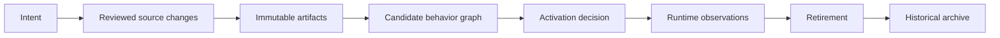
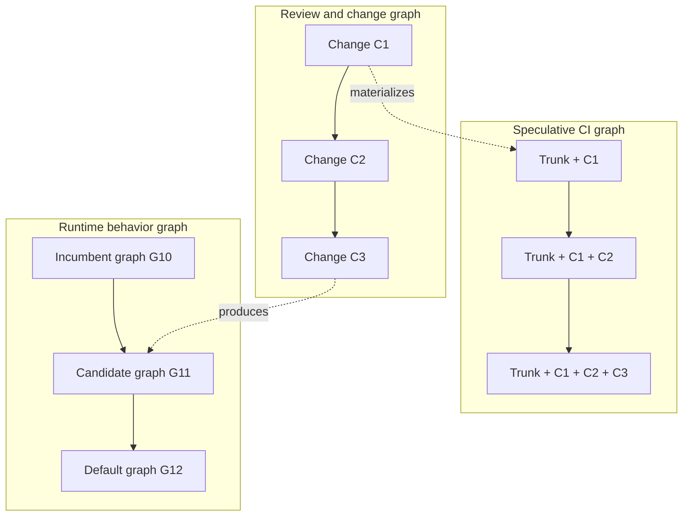
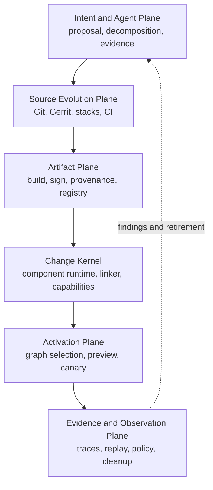
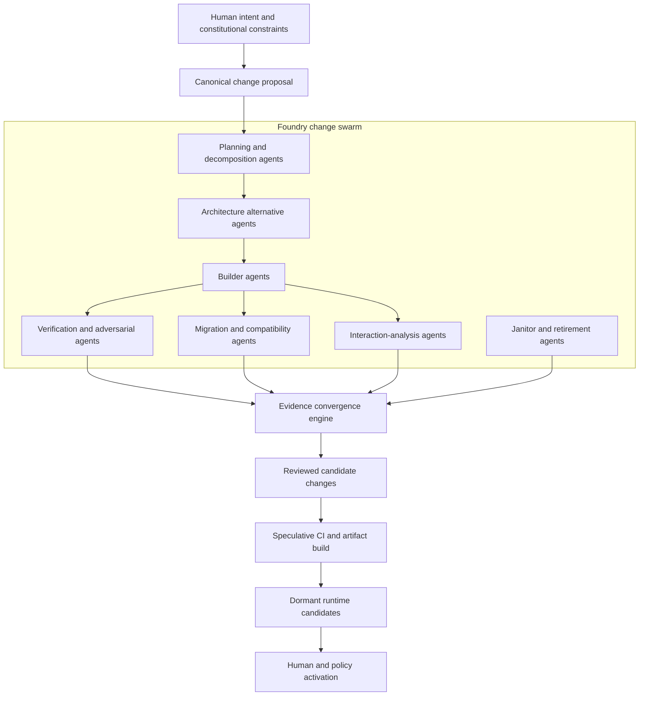
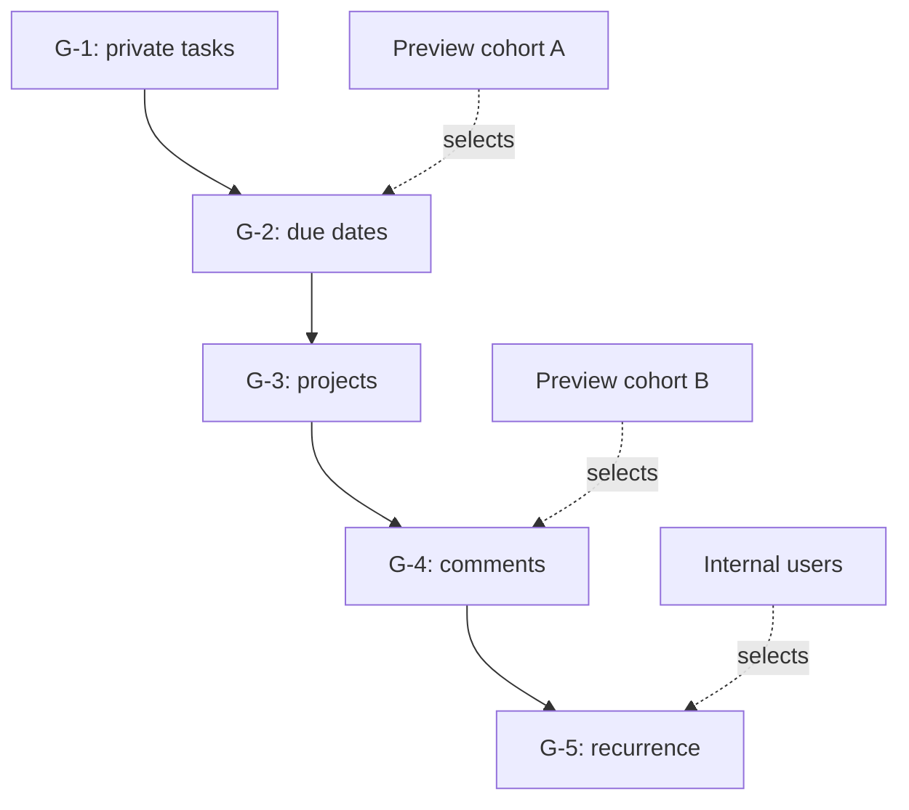
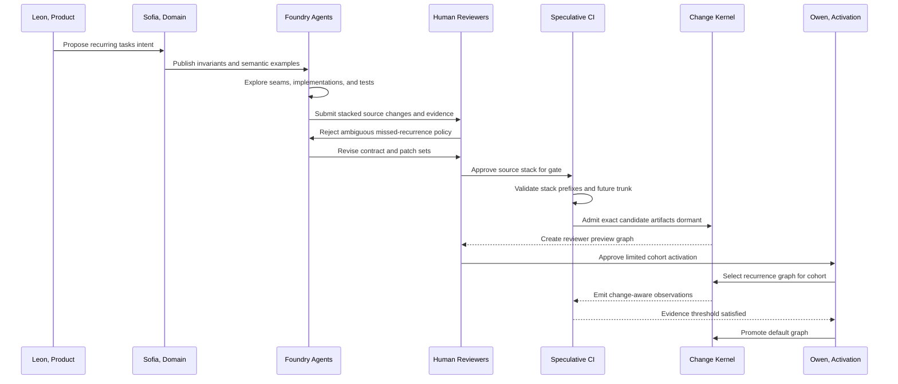
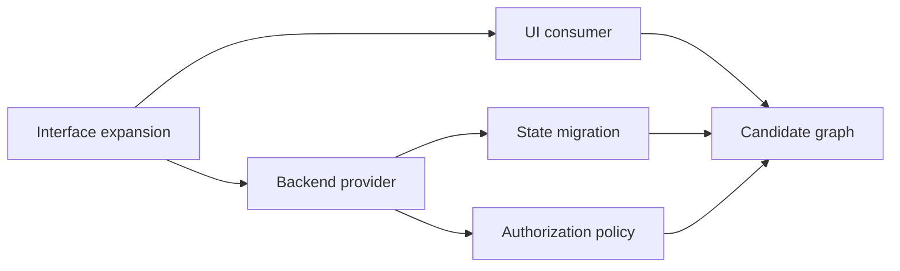
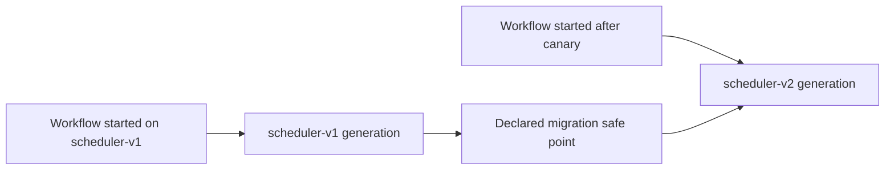
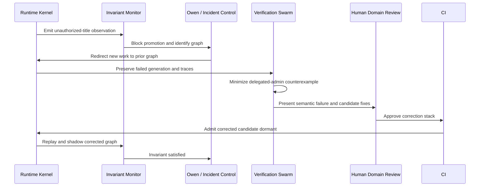
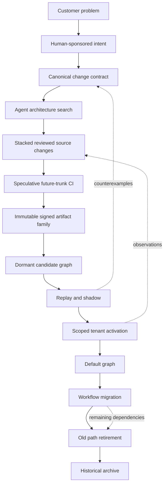

# Change-Oriented Software

## Designing, Building, and Maintaining Systems That Can Always Become Something Else

*A pragmatic mini-book for human and AI-agent software engineering*

**Audience:** Staff engineers, architects, platform teams, engineering leaders, and builders of agent-programming systems  
**Status:** Reviewed mini-book manuscript

---

## Preface: Software Is a Process of Becoming

Most software methods treat the program as the primary object and changes as temporary disturbances applied to it.

We speak of the application, the current version, the production build, the release, and the codebase. A change begins as an issue, becomes a branch or patch, turns into a build, and then disappears into the next version. After deployment, the running system usually cannot answer which behavior came from which intent, which review approved it, which data migration made it possible, or which users should receive it.

**Change-oriented software reverses that relationship.**

The program is not the fundamental object. The program is the temporary result of composing a selected set of changes.

```text
Running software =
    trusted kernel
    + selected behavior implementations
    + selected schemas
    + selected policies
    + selected capabilities
    + activation context
```

A meaningful change does not disappear after merge. It remains identifiable as it moves through a lifecycle:

```text
proposed
reviewed
integrated
materialized
admitted
previewed
shadowed
activated
stabilized
retired
archived
```

The methodology does **not** promise that every arbitrary change is safe, correct, reversible, or independently composable. That would be unrealistic. It promises something more precise:

> Every meaningful behavioral change should remain identifiable, inspectable, previewable, selectable, observable, and governable throughout its useful life.

This book develops that idea into a practical methodology using techniques that already exist:

- trunk-based development;
- small and stacked reviews;
- Gerrit-style patch sets;
- speculative CI gating;
- branch by abstraction;
- parallel change and expand/contract migrations;
- feature flags and progressive delivery;
- component models and capability boundaries;
- durable workflows and event replay;
- immutable artifacts and provenance;
- evolutionary architecture and fitness functions;
- AI agents for construction, verification, and retirement.

The novel move is not any individual tool. It is making the **change** the shared unit across intent, source control, review, CI, runtime composition, activation, observation, and retirement.

---

## A Reader's Contract: What This Book Is and Is Not Claiming

The phrase “a runtime that can become any software” is aspirational shorthand. A domain-empty runtime can become any application expressible through the capabilities, interfaces, resources, and trusted providers available to it. It cannot spontaneously become a device driver, control hardware it cannot access, comply with an unstated law, or safely perform an irreversible action merely because an agent generated code for it.

The methodology distinguishes:

- **Domain emptiness:** the kernel begins without concepts such as tasks, invoices, games, or customers.
- **Capability completeness:** the kernel already knows how to load code, schedule work, store state, mediate effects, observe execution, and enforce authority.
- **Capability frontier:** the system can evolve only within powers exposed by trusted host providers.
- **Root of trust:** the kernel, policy engine, identity system, and privileged providers evolve more conservatively than ordinary application behavior.

The practical promise is narrower and more useful:

> New behavior can be introduced beside existing behavior, inspected in a running system, and activated by scope only after sufficient evidence exists—without requiring the currently active behavior to change at merge or deployment time.

This book optimizes primarily for **evolvability and correctness**. Cost, security, and operational safety appear where they affect those goals, but they do not replace them as the organizing principle.

---

## Book Map

### Part I — Foundations

1. Is There Already a Methodology for This?
2. The Missing Unit of Software Engineering
3. The Change Contract
4. The Laws of Change-Oriented Software

### Part II — Preparing Evolvable Changes

5. From Intent to Change Proposal
6. Source Control as a Change Ledger
7. Gerrit, Patch Sets, and Stacked Reviews
8. Continuous Integration as Continuous Proof
9. Source Submission, Runtime Admission, and Activation
10. Architectural Seams and Parallel Worlds
11. What If Every Change Had a Flag?
12. State, Data, and Irreversible Reality

### Part III — Runtime Evolution

13. Evidence-Oriented Engineering
14. The Domain-Empty Change Kernel
15. A Practical Technology Stack
16. Activation Is Not Deployment
17. Observation, Rollback, and Retirement

### Part IV — Agent-Native Engineering

18. The Agent Software Organization
19. Building the Platform Now
20. A Complete Evolution Story

### Part V — The Company Case Study

21. LatticeWorks and the Life of Relay

### Part VI — Beyond Today's Constraints

22. One Thousand Times More Compute and Intelligence
23. The Change-Oriented Organization

---

# Part I — Foundations

# 1. Is There Already a Methodology for This?

There is substantial work on nearly every part of change-oriented software, but no widely adopted discipline unifies it around a single first-class change lifecycle.

**Continuous Delivery** teaches small batches, releasable mainlines, automated verification, and separation of deployment from release.

**Evolutionary Architecture** teaches incremental structural change constrained by executable fitness functions.

**Branch by Abstraction**, **Parallel Change**, the **Strangler** pattern, and **expand/contract migrations** teach coexistence between old and new representations.

**Feature management** and **progressive delivery** teach runtime selection, canaries, cohorts, and separation of presence from exposure.

**Software product-line engineering** studies explicit variability, dependency constraints, invalid combinations, and families of possible products.

**Dynamic software updating** explores changing executing code and transforming state without stopping a system.

**Erlang/OTP** demonstrates supervision, process isolation, and concurrent old and new code versions.

**Live programming environments** show that partially constructed software can remain meaningful and inspectable.

**Self-adaptive systems** contribute feedback loops such as MAPE-K: monitor, analyze, plan, execute, and shared knowledge.

**WebAssembly Components, WASI, Wasmtime, wasmCloud, Temporal, Nix, Unison, OpenFeature, OPA, OpenTelemetry, Sigstore, and SLSA** provide modern implementation materials.

Modern coding agents usually inherit the existing repository model:

```text
inspect files
edit source
run commands
execute tests
submit patch or pull request
```

They improve who performs the work, but usually do not redefine what a change is, how it exists in the running system, or how it is retired.

The missing discipline is the connective tissue:

> Intent, source changes, review decisions, executable artifacts, runtime selections, evidence, and retirement obligations should all refer to the same logical change.

---

# 2. The Missing Unit of Software Engineering

A file is a storage unit.

A commit is a source-history unit.

A pull request is a review unit.

A build is a materialization unit.

A deployment is an installation event.

A feature is a product concept.

A service is an operational boundary.

None reliably represents a complete behavioral change.

Consider:

> Allow users to schedule recurring tasks.

This may require:

- a recurrence policy interface;
- an additive schema change;
- a compatibility reader;
- a timer capability;
- a UI editor;
- a background workflow;
- telemetry;
- an activation rule;
- a state migration;
- retirement of old readers.

Those pieces may span multiple commits, pull requests, repositories, artifacts, and deployments. Yet they express one coherent intent.

Change-oriented software separates four identities.

## 2.1 Intent identity

Why does the change exist?

```text
INTENT-204
Allow tasks to recur according to a user-defined schedule.
```

## 2.2 Source identity

Which reviewed source transformations implement it?

```text
SC-781
SC-785
SC-790
SC-804
```

## 2.3 Artifact identity

Which immutable executable objects were produced?

```text
recurrence-engine@sha256:...
recurrence-editor@sha256:...
task-migrator@sha256:...
```

## 2.4 Runtime identity

Which valid behavior graph contains the change?

```text
behavior-graph G-184
```

These identities are linked rather than collapsed.



This makes questions answerable that are usually difficult:

- Why did this request behave this way?
- Which change selected this implementation?
- Which source and build produced it?
- Which users were exposed?
- Which state schema was in use?
- Which evidence authorized activation?
- What must be removed when the transition ends?

---

# 3. The Change Contract

A change is not merely a diff. It is a structured proposition:

> Under these conditions, introduce or replace this behavior while preserving these invariants, using these capabilities and state transformations.

A practical change contract might look like this:

```yaml
change:
  id: change://tasks/recurrence/v1
  intent: Allow users to create repeating tasks.
  kind: behavioral-extension

requires:
  - interface://tasks/store/v2
  - capability://clock/timers/v1

provides:
  - interface://tasks/recurrence/v1

invariants:
  - existing task identifiers remain unchanged
  - non-recurring tasks preserve current behavior
  - recurrence expansion is deterministic
  - deactivation does not delete recurrence data

state:
  reads:
    - schema://task/v1
    - schema://task/v2
  writes:
    - schema://task/v2
  upgrade:
    - component://migrate-task-v1-v2
  downgrade:
    - component://project-task-v2-v1

effects:
  - type: timer-schedule
    idempotency: required
    reversible: true
  - type: notification
    idempotency: required
    reversible: false
    compensation: none

activation:
  default: dormant
  supported_scopes:
    - preview-session
    - user
    - tenant
    - percentage
    - global

retirement:
  temporary_selectors:
    - recurring-tasks-release
  cleanup_conditions:
    - globally-active-for-30-days
    - no-v1-state-readers
```

The contract does not need to live in one file. Some properties may be derived from typed interfaces, policy, tests, schema definitions, build metadata, and activation configuration. But the platform must be able to assemble the complete view.

## 3.1 Change relationships

Changes compose only through explicit relationships:

```text
requires
conflicts-with
supersedes
adapts
migrates
observes
compensates
```

Example:

```text
recurrence-ui@2
    requires recurrence-api@2

recurrence-api@2
    requires task-schema@2

task-schema@2
    conflicts with legacy-exporter@1
    unless task-v2-to-v1-adapter@1 is active
```

This is a constrained composition problem, not a bag of arbitrary toggles.

## 3.2 The three linked graphs

The methodology operates three separate but related graphs.



The review graph expresses intellectual dependency. The CI graph expresses possible future repository and artifact states. The runtime graph expresses selectable behavior. Confusing them causes many delivery failures.

---

# 4. The Laws of Change-Oriented Software

## Law 1: Deployment and activation are separate decisions

Software may contain behavior without selecting it for ordinary execution.

## Law 2: Every active behavior has provenance

The system can identify the change, artifact, graph, rule, and context that selected it.

## Law 3: New behavior is dormant by default

Presence is not permission.

## Law 4: Old and new behavior coexist before replacement

Replacement is a transition, not a destructive instant.

## Law 5: Breaking changes are decomposed

Use expand, adapt, migrate, switch, and contract.

## Law 6: State transformations are part of the change

A change that cannot explain its relationship to existing state is incomplete.

## Law 7: Effects are classified

Pure computation, transactional writes, idempotent actions, compensatable actions, and irreversible actions cannot be treated identically.

## Law 8: Activation is scoped

A behavior may be active for a request, preview, user, tenant, cohort, workflow generation, or everyone.

## Law 9: Evidence travels with the artifact

Tests are not only a moment in CI. Their applicability and provenance accompany the artifact.

## Law 10: Transitional machinery expires

Temporary selectors, adapters, schema readers, and shadow paths require retirement conditions.

## Law 11: History is append-only; maintained code is not

Preserve the history while simplifying the active source.

## Law 12: Agents propose; deterministic mechanisms authorize

Agents may construct and recommend. Policies, signatures, invariants, and approvals determine what can happen.

---

# Part II — Preparing Evolvable Changes

# 5. From Intent to Change Proposal

The most valuable stage occurs before code generation.

A request such as:

> Make search better.

should not immediately produce edits to `search.ts`. It should first produce a proposal:

```yaml
intent:
  problem:
    Users cannot reliably find documents when they use synonyms.

  desired_outcome:
    Improve successful result selection for synonym-heavy queries.

  non_goals:
    - changing document authorization
    - changing retention
    - changing exact-match ordering

  acceptance:
    - exact-match precision must not decrease materially
    - p95 latency may increase by no more than 10 ms
    - no unauthorized document may become visible
    - the candidate must be shadowable

  seam:
    interface: search://ranking/v2

  strategy:
    pattern: branch-by-abstraction
    candidate: semantic-ranking@1
    incumbent: lexical-ranking@4

  data:
    new_index_fields:
      - semantic-vector
    migration: additive-background-fill

  activation:
    preview: author
    shadow: full-traffic
    canary: one-percent
    global: evidence-gated

  retirement:
    remove:
      - lexical-semantic-comparison-logger
      - semantic-ranking-release-selector
```

The proposal answers five questions:

1. What behavior is desired?
2. What must remain true?
3. Where is the architectural seam?
4. What new authority or state is required?
5. How does the transition end?

## 5.1 Review should move upward

As agents make source generation cheap, humans should spend less attention on repetitive syntax and more on:

- purpose;
- invariants;
- product semantics;
- authority;
- migration strategy;
- user-visible consequences;
- retirement conditions.

Agents and deterministic tools can shoulder more of:

- style;
- test generation;
- dependency analysis;
- API compatibility;
- dead-path detection;
- repetitive implementation inspection.

The output of the planning stage is not “write code.” It is a constrained change contract.

## 5.2 Five separate approvals

```text
Intent review
    Is this the right behavior?

Architecture review
    Is this the right decomposition and transition?

Source review
    Is the implementation healthy and maintainable?

Runtime admission
    Is this exact artifact valid to load here?

Activation approval
    Should this population receive it now?
```

Combining all five into one pull-request approval overloads reviewers and hides the difference between “good code” and “ready to become authoritative behavior.”

---

# 6. Source Control as a Change Ledger

Git remains useful, but it becomes one ledger rather than the ontology of the running system.

## 6.1 Protected trunk

The default workflow is:

```text
small reviewed change
    ↓
automated evidence
    ↓
merge queue or speculative gate
    ↓
trunk
```

The trunk may contain:

- dormant implementations;
- unused interfaces;
- compatibility readers;
- shadow instrumentation;
- candidate components;
- incomplete features whose active path remains unchanged.

The requirement is not that every merged change be user-visible. It is:

> Every integrated revision preserves the validity of the currently active behavior graph.

## 6.2 Small source changes, coherent product changes

One product change may require a stack:

```text
SC-101  Add ranking interface.
SC-102  Wrap incumbent implementation.
SC-103  Add candidate implementation.
SC-104  Add differential test harness.
SC-105  Add selection manifest.
SC-106  Add shadow telemetry.
```

Each source change has one purpose. Together they materialize one coherent product change.

## 6.3 Semantic provenance

Commit or review metadata should identify the logical change and transition stage:

```text
search: introduce ranking provider interface

Change: CHANGE-search-ranking-v2
Stage: introduce-seam
Behavioral impact: none
Runtime activation: not applicable
```

Later:

```text
search: admit semantic ranking candidate

Change: CHANGE-search-ranking-v2
Stage: candidate-admission
Behavioral impact: preview contexts only
Runtime activation: semantic-ranking-preview
```

A textual diff remains useful, but an agent-era review should also present:

```text
intent
architecture delta
behavioral delta
capability delta
schema delta
tests and counterexamples
replay results
runtime preview
retirement plan
```

---

# 7. Gerrit, Patch Sets, and Stacked Reviews

Gerrit is unusually aligned with the methodology because it has a durable concept of a **change** independent of any single commit hash.

A Gerrit `Change-Id` remains stable while the implementation evolves through patch sets:

```text
Change identity:
    I8f31c...

Patch set 1:
    initial implementation

Patch set 2:
    corrected migration

Patch set 3:
    narrower capability boundary

Patch set 4:
    final reviewed implementation
```

This creates three useful levels:

```text
Patch set
    One revision of a source change.

Gerrit change
    One independently reviewed source transformation.

Topic or stack
    Multiple source changes implementing a larger intent.
```

Above them sits the product-level change:

```text
CHANGE-recurring-tasks
```

## 7.1 Stacked changes are the natural shape of evolutionary work

A replacement should usually arrive as a sequence:

```text
C1  Introduce SearchRanking interface.
C2  Move incumbent behavior behind the interface.
C3  Introduce candidate implementation.
C4  Add differential execution.
C5  Add preview selection.
C6  Expand the index schema.
C7  Admit the complete candidate graph.
```

Each review is intellectually coherent. Reviewers can reason about one architectural move at a time.

The critical rule is:

> Every mergeable prefix of the stack must preserve the currently active behavior.

That does not mean every prefix exposes the completed feature.

```text
P1 = trunk + C1
    New interface exists; behavior unchanged.

P2 = trunk + C1 + C2
    Incumbent is behind interface; behavior unchanged.

P3 = trunk + C1 + C2 + C3
    Candidate exists but is dormant.

P4
    Candidate can be shadowed.

P5
    Candidate is previewable for selected contexts.

P6
    New schema coexists with old schema.

P7
    Complete candidate graph exists; production default unchanged.
```

## 7.2 Dependency-aware evidence

A stack is not just a visual convenience. It is a change dependency graph. Lower changes define assumptions used by higher changes.

When a lower patch set changes, only dependent evidence should become stale. Content-addressed evidence can express this:

```text
Evidence E4 depends on:
    trunk digest
    C1 patch-set digest
    C2 patch-set digest
    C3 patch-set digest
    C4 patch-set digest
    toolchain digest
    test-suite digest
```

This turns CI reuse into dependency tracking rather than guesswork.

---
# 8. Continuous Integration as Continuous Proof

Traditional CI asks:

> Does this patch pass?

Change-oriented CI asks:

- Does this change preserve the currently active system?
- Does the proposed stack form a valid future source state?
- Can its artifacts be reproduced?
- Can the candidate graph be loaded?
- Can it be previewed without becoming default?
- What evidence is still missing for activation?
- Can its transitional machinery later be retired?

CI becomes a continuous evaluator of **change graphs**.

## 8.1 Three integration contexts

### Submitted patch-set context

```text
author-selected base
+
declared ancestors
+
current patch set
```

This gives fast feedback.

### Latest-trunk projection

```text
current trunk
+
rebased or merged stack
```

This determines whether the stack remains valid now.

### Speculative queue state

```text
current trunk
+
approved changes ahead
+
this change or stack
```

This evaluates the future repository state that will actually exist if the queue succeeds.

## 8.2 Speculative gating

Suppose the queue is:

```text
A
B
C
```

A dependent gate can test:

```text
A against T + A
B against T + A + B
C against T + A + B + C
```

If `B` fails, `C` must be retested against the future without `B`.

Change-oriented CI extends this idea beyond source:

```text
future source state
future artifact set
future behavior graph
future compatibility state
future activation defaults
```

## 8.3 CI as the compiler of the behavior graph

```text
reviewed change graph
    ↓
validated source state
    ↓
immutable components
    ↓
candidate behavior graph
    ↓
evidence bundle
    ↓
dormant runtime admission
```

The result is not merely green or red:

```yaml
candidate:
  change: CHANGE-search-ranking-v2
  source_state: sha256:source...
  artifact_set: sha256:artifacts...
  behavior_graph: G-candidate-418

current_graph_preserved: true
previewable: true
shadowable: true
globally_activatable: false

blocking_conditions:
  - capability approval required for vector-index-read
  - shadow evidence incomplete
```

A source change may be mergeable while its runtime candidate is not globally activatable. That separation is a feature, not a defect.

## 8.4 Validate meaningful prefixes, not arbitrary fragments

The strong rule is not that every intermediate patch must be independently deployable in isolation. Some review-only patches exist solely on a dependency chain. The rule is:

- every prefix eligible to merge must preserve the active system;
- every review-only dependent state must be testable with its declared ancestors;
- the stack head must materialize the intended candidate graph;
- CI must make the distinction visible.

This avoids turning “small changes” into meaningless fragmentation.

## 8.5 CI continues after merge

Before review, CI checks source and contracts.

During review, it builds patch-set previews and stack projections.

At integration, it evaluates speculative future trunk states.

After admission, it performs replay and shadow comparison.

During activation, it evaluates canary evidence.

During retirement, it proves that obsolete paths are unreferenced.

CI is not a gate between coding and merge. It is the continuing proof relationship between a change and the system around it.

---

# 9. Source Submission, Runtime Admission, and Activation

These are different gates because they answer different questions.

## 9.1 Source-submit gate

Determines whether source may enter trunk.

It asks:

- Is the change maintainable?
- Does it preserve the active graph?
- Is the stack valid?
- Are owners satisfied?
- Are compatibility obligations explicit?

## 9.2 Runtime-admission gate

Determines whether an artifact may be loaded into a target runtime.

It asks:

- Is the artifact signed?
- Was it built from reviewed source?
- Are requested capabilities permitted?
- Can interfaces be linked?
- Can supported state be read?
- Does the target runtime support the component?
- Is the preview mode appropriate?

## 9.3 Activation gate

Determines whether a loaded candidate may receive authoritative work.

It asks:

- Is the required evidence present?
- Is the activation scope permitted?
- Is state migration ready?
- Is the fallback still valid?
- Are effect semantics understood?
- Has the selected policy authorized promotion?

```mermaid
stateDiagram-v2
    [*] --> Proposed
    Proposed --> Reviewed: intent and architecture accepted
    Reviewed --> Integrated: source-submit gate
    Integrated --> Materialized: reproducible build
    Materialized --> Admitted: runtime-admission gate
    Admitted --> Preview: scoped selection
    Preview --> Shadow: non-authoritative comparison
    Shadow --> Canary: activation gate
    Canary --> Default: evidence threshold met
    Default --> SolePath: migration complete
    SolePath --> Retired: old path unreferenced
    Retired --> [*]
```

## 9.4 Build once, promote the exact artifact

The exact reviewed artifact should move through:

```text
review preview
development admission
production admission
shadow
canary
global activation
```

A patch-set revision produces a new digest. Evidence for the old digest cannot authorize the new one.

```text
Logical change:
    I8f31c...

Exact reviewed source:
    patch set 6

Exact executable:
    sha256:bbb...
```

Environment-specific values should be injected as configuration or capabilities rather than by rebuilding source. Where multiple target architectures are unavoidable, the logical artifact is a reproducibly built, signed **artifact family** whose members share one reviewed source and contract.

## 9.5 Gerrit submit requirements as evidence requirements

A change-oriented Gerrit installation might use labels such as:

```text
Code-Review
Verified
Contract-Compatible
Architecture-Fitness
Migration-Safe
Capability-Approved
Preview-Ready
Retirement-Defined
```

Requirements vary by risk. A pure refactoring does not need migration approval. A stateful capability change does.

Agents may generate evidence for labels. They should not self-authorize the labels whose meaning depends on independent judgment.

---

# 10. Architectural Seams and Parallel Worlds

Branch by Abstraction turns source modularity into runtime selectability.

Suppose the original code calls a concrete function:

```typescript
const results = legacySearch(query);
```

Introduce a seam:

```typescript
export interface SearchRanking {
  rank(query: Query, candidates: Candidate[]): RankedResult[];
}
```

Wrap the incumbent:

```typescript
export class LexicalRanking implements SearchRanking {
  rank(query: Query, candidates: Candidate[]): RankedResult[] {
    return legacySearch(query, candidates);
  }
}
```

Add the candidate beside it:

```typescript
export class SemanticRanking implements SearchRanking {
  rank(query: Query, candidates: Candidate[]): RankedResult[] {
    return rankSemantically(query, candidates);
  }
}
```

Do not scatter activation conditionals throughout the implementation. Select at the seam:

```text
search:ranking
    production-default -> lexical-ranking@4
    preview:Jesse      -> semantic-ranking@1
    shadow             -> compare(lexical-ranking@4,
                                  semantic-ranking@1)
```

## 10.1 Core patterns

### Branch by Abstraction

Create the stable seam before the replacement.

### Parallel Change

Support old and new contract forms concurrently.

### Expand and Contract

Add the new representation, migrate usage, then remove the old form.

### Strangler

Progressively route responsibility from a legacy subsystem into a new one.

### Ports and Adapters

Keep domain behavior separate from clocks, storage, networking, and external services.

### Microkernel

Keep coordination and authority in a small host while replaceable behavior lives in components.

### Anti-corruption adapters

Prevent transitional dependencies from contaminating the new model.

### Dual reading, single writing

Read old and new forms while moving writes toward one authoritative representation.

### Differential execution

Run incumbent and candidate against the same input and compare their outputs.

A good abstraction is not merely clean code. It is an **activation surface**.

## 10.2 Seam quality determines change quality

A seam should be:

- narrow enough to understand;
- stable enough to outlive one implementation;
- typed enough to verify;
- observable enough to compare;
- externally selectable;
- free of hidden shared mutable state where possible.

A poor seam merely hides coupling. A good seam isolates a meaningful behavioral decision.

---

# 11. What If Every Change Had a Flag?

There are two different interpretations.

## 11.1 A Boolean conditional for every source change

```typescript
if (flag("SC-101")) { /* ... */ }
if (flag("SC-102")) { /* ... */ }
if (flag("SC-103")) { /* ... */ }
```

This creates:

- path multiplication;
- stale branches;
- unclear interactions;
- difficult testing;
- difficult deletion;
- nonsensical configurations.

This should not be the default.

## 11.2 An addressable selector for every behavioral change

Every behavioral change receives:

- an identity;
- a presence state;
- a selectable implementation;
- dependency constraints;
- activation metadata;
- provenance;
- retirement metadata.

```yaml
change: ranking-normalization-v3

selects:
  interface: search:normalizer
  implementation: normalizer@3

requires:
  - tokenizer@2

conflicts:
  - legacy-accent-preservation@1

default:
  inactive
```

This “flag” is actually a constrained graph-selection primitive.

## 11.3 From flags to feature models

Independent flags are the wrong abstraction:

```text
A on/off
B on/off
C on/off
```

Use constraints:

```text
B requires A
C conflicts with B
D requires exactly one of E or F
G is permitted only for enterprise tenants
```

The activation controller compiles a valid graph.

## 11.4 The combinatorial problem

One thousand independent Boolean flags imply roughly `2^1000` configurations. More compute does not make full enumeration realistic.

Practical control requires:

- explicit dependencies and conflicts;
- exclusion of unreachable states;
- validation of selected graphs rather than all theoretical graphs;
- pairwise or targeted interaction testing;
- family-based static analysis;
- historical replay of common configurations;
- risk-directed deeper analysis.

## 11.5 Agent-managed selectors

Agents can manage variation at a scale humans cannot comfortably track:

- detect universally selected candidates;
- find selectors with no evaluations;
- identify old workflows preventing retirement;
- propose cleanup changes;
- discover failure-correlated interactions;
- tighten constraints;
- merge equivalent variants;
- explain why a path remains active.

The conclusion is:

> Give every meaningful behavioral change an addressable runtime identity. Do not give every source edit a permanent Boolean branch.

---

# 12. State, Data, and Irreversible Reality

Code loading is easier than preserving meaning while state evolves.

## 12.1 Expand, adapt, migrate, switch, contract

Suppose:

```json
{
  "id": "task-42",
  "title": "Submit report",
  "due": "2026-08-01"
}
```

becomes:

```json
{
  "id": "task-42",
  "title": "Submit report",
  "schedule": {
    "firstDue": "2026-08-01",
    "recurrence": null
  }
}
```

A safe transition:

1. Add `schedule`.
2. Teach readers to understand both forms.
3. Write new records using `schedule`.
4. Backfill existing records.
5. Confirm old writers are gone.
6. Stop reading `due`.
7. Remove `due` in a retirement change.

## 12.2 Stable state, replaceable behavior

Where practical, the host owns durable identity and state:

```text
Task actor:
    identity     stable
    mailbox      stable
    history      stable
    behavior     replaceable
```

At transition, the runtime may:

- pin existing work to the old implementation;
- migrate state at a safe point;
- replay event history under the candidate;
- run a non-authoritative shadow execution.

## 12.3 Effects need precise semantics

Classify effects:

```text
pure
read-only
transactional
idempotent
compensatable
irreversible
```

Prefer effect intents:

```json
{
  "effect": "send-notification",
  "recipient": "user-42",
  "template": "task-overdue",
  "idempotencyKey": "task-42:overdue:2026-08-01"
}
```

The host validates authority, records the intent, checks idempotency, executes it, records the outcome, and invokes compensation where available.

## 12.4 Rollback is not one thing

- **Activation rollback:** redirect new work to a previous graph.
- **Execution pinning:** allow existing work to finish on its original generation.
- **State downgrade:** transform state back only when a defined downgrade preserves meaning.
- **Forward repair:** introduce a correcting change when downgrade is unsafe.
- **Effect compensation:** perform an explicit counter-action when possible.
- **Irreversible acceptance:** record that an effect cannot be undone.

The methodology promises activation rollback where possible, state migration or downgrade where defined, and compensation where reversal is impossible.

---

# Part III — Runtime Evolution

# 13. Evidence-Oriented Engineering

Traditional delivery often produces one Boolean result:

```text
tests passed
```

Change-oriented software needs richer evidence.

## 13.1 Evidence classes

### Unit evidence

Does the component perform its local function?

### Contract evidence

Does it implement its declared interface?

### Compatibility evidence

Can old and new producers, consumers, and schemas coexist?

### Property evidence

Do invariants hold over generated inputs?

```text
normalizing a query twice equals normalizing it once
```

### Metamorphic evidence

Does a transformation preserve an expected relationship?

```text
adding an unauthorized document must not change authorized results
```

### Differential evidence

How does the candidate differ from the incumbent?

A difference is not automatically a defect. It becomes inspectable evidence.

### Replay evidence

Can historical events be processed successfully under the candidate?

### Shadow evidence

How would the candidate behave on current traffic without becoming authoritative?

### Canary evidence

What happens when the change controls a small amount of real work?

### Architectural evidence

Does the change preserve dependency, modularity, performance, ownership, and capability constraints?

## 13.2 The evidence bundle

```yaml
evidence:
  change: CHANGE-search-ranking-v2
  artifact: sha256:719c...

  unit:
    passed: 842
    failed: 0

  contracts:
    search-ranking-v2: pass

  compatibility:
    old-client-new-provider: pass
    new-client-old-provider: pass

  replay:
    traces: 1000000
    crashes: 0
    invariant_violations: 0

  differential:
    changed_top_result: 4.2-percent
    exact_match_regressions: 0.01-percent

  performance:
    p95_delta_ms: 7
    memory_delta_mb: 14

  architecture:
    unauthorized_dependencies: 0
    capability_expansion:
      - vector-index-read
```

## 13.3 Evidence is a lattice, not one green check

```text
Source correctness           passed
Current graph preservation   passed
Candidate graph validity     passed
Schema compatibility         passed
Migration reversibility      partial
Capability approval          pending
Replay compatibility         passed
Shadow comparison            not started
Canary evidence              unavailable
Retirement plan              passed
```

The correct question is not “Is CI green?” It is:

> Is there sufficient evidence for the next lifecycle transition?

---

# 14. The Domain-Empty Change Kernel

The runtime begins with no application domain.

It does not know what a task, invoice, game, patient, or document is.

It does know how to:

- verify artifacts;
- load components;
- link typed interfaces;
- mediate capabilities;
- maintain behavior graphs;
- store state;
- schedule work;
- execute effects;
- observe behavior;
- activate generations;
- retire unused objects.

This is a **domain-empty kernel**, not a capability-empty process.

Its ability to “become any software” is bounded by its capability frontier. If it can provide HTTP, durable state, timers, messaging, files, rendering, and approved external services, it can become many kinds of applications. It cannot invent authority or hardware access the host never exposes.

## 14.1 Behavior graphs

```text
Graph G-184

HTTP /tasks
    -> auth@3
    -> task-api@7
    -> task-store@4

Timer task-recurrence
    -> recurrence-engine@2
    -> task-store@4

UI task-list
    -> task-view@8
```

A candidate may produce:

```text
G-185 =
    G-184
    - recurrence-engine@2
    + recurrence-engine@3
```

The graph compiler validates:

- interface satisfaction;
- dependency closure;
- conflicts;
- capability grants;
- supported schema readers;
- activation fallback;
- runtime compatibility.

## 14.2 Side-by-side before mutation

The default mechanism should be:

```text
load beside
link beside
test beside
route gradually
pin old work
migrate state explicitly
retire when safe
```

Literal in-memory replacement remains useful for specialized processes, but side-by-side immutable generations are easier to reason about.

## 14.3 Request pinning

```text
request
    ↓
resolve activation context
    ↓
select behavior graph
    ↓
pin request to generation
    ↓
execute
```

Existing work can finish under the old generation while new work uses the candidate.

## 14.4 The behavior graph is an operational graph

“Behavior graph” is shorthand. A real graph may include:

- components and interfaces;
- routes and triggers;
- state schemas and migration edges;
- durable workflow generations;
- capability grants;
- resource and placement constraints;
- activation rules;
- evidence references.

The key property is that the selected operational configuration is explicit and reproducible.

---

# 15. A Practical Technology Stack

No one technology implements the methodology. A pragmatic stack combines several.

## WebAssembly Component Model and WIT

Use for:

- typed language-neutral interfaces;
- generated bindings;
- explicit imports and exports;
- versioned component contracts.

## WASI

Use for capability-oriented execution without ambient authority.

## Wasmtime

Use as an embeddable component runtime with resource controls.

## wasmCloud

Use where components must be linked and distributed across machines.

## Erlang/OTP

Use directly for trusted actor-heavy systems, or borrow its supervision, coexistence, and state-transition ideas.

## Temporal

Use for durable workflows, replay histories, and version-aware long-running work.

## Nix and NixOS

Use for reproducible builds, immutable host dependencies, atomic machine generations, and host rollback.

## Unison

Use as conceptual inspiration for content-addressed definitions and structured code storage.

## OpenFeature

Use as the basis of context-aware selection, extended beyond Boolean flags to component or graph selection.

## Open Policy Agent

Use for admission and activation policy.

## OpenTelemetry

Attach:

```text
change.id
artifact.digest
graph.generation
component.version
activation.rule
preview.session
state.schema
```

to traces, metrics, and logs.

## Sigstore and SLSA

Use for artifact signatures and build provenance.

## Gerrit, Zuul, merge queues, and stacked-PR tools

Use for durable review identity, dependency-aware review, and speculative future-state validation.

## Argo Rollouts or Flagger

Use for workload-level progressive delivery. The change kernel applies similar ideas at component and behavior-graph granularity.

## PostgreSQL, event logs, and transactional outbox

Use ordinary durable technology first. Change orientation does not require inventing a new database. It requires explicit schema versions, compatibility readers, migration state, and effect intent records.

---

# 16. Activation Is Not Deployment

A candidate can be present and immediately visible without being the default.

## 16.1 Activation contexts

```text
development namespace
review session
preview token
specific user
specific tenant
workflow generation
request header
test agent
shadow evaluator
percentage cohort
global default
```

## 16.2 Personal behavior universes

```text
Production default:
    G-184

Jesse preview:
    G-184 + recurrence-v2

Reviewer preview:
    G-184 + recurrence-v2 + diagnostics

Shadow:
    execute G-184 and G-185
    publish G-184 result
```

The candidate uses the same runtime and behavior model, but not necessarily the same process placement, data authority, or effect authority.

## 16.3 Preview state modes

### Synthetic

Generated data and no production access.

### Read-only production projection

Approved real data may be read, but writes and effects are blocked.

### Copy-on-write overlay

Reads begin from a baseline, but candidate writes enter an isolated overlay.

### Replay

Historical events are re-executed with effects disabled.

### Shadow

Current inputs reach the candidate, but the incumbent remains authoritative.

### Canary

The candidate performs real work for a controlled cohort.

## 16.4 Activation maturity

```text
0  admitted
1  developer-preview
2  reviewer-preview
3  replay-validated
4  shadow
5  canary
6  limited-release
7  default
8  sole-supported-path
9  transitional-machinery-removed
```

A feature is not complete at level 7. It is complete at level 9.

## 16.5 Activation policy is reviewed separately

Implementation source should not silently change the production default. A separate control-plane change can express:

```diff
- default tasks:recurrence -> no-recurrence@1
+ default tasks:recurrence -> recurrence@2
```

This isolates the decision to expose behavior from the decision to admit its implementation.

---

# 17. Observation, Rollback, and Retirement

Dynamic systems require exact causal reconstruction.

A trace should include:

```text
trace_id: 7f39...
user_id: user-42
graph_generation: G-185
change_set:
    - CHANGE-auth-v3
    - CHANGE-task-schema-v2
    - CHANGE-recurrence-v2

selected_component:
    tasks:recurrence -> recurrence-engine@2

activation:
    rule: tenant-canary
    selector_revision: 19
```

This supports questions such as:

- Did the failure begin when the change activated?
- Does it occur under the old graph?
- Which users received the candidate?
- Which interaction of changes correlates with the problem?
- Which source and builder produced the component?

## 17.1 Automated response

A controller may:

1. observe an invariant or error-rate regression;
2. identify affected graph generations;
3. stop further promotion;
4. redirect new work to the previous graph;
5. preserve the failed generation for diagnosis;
6. invoke compensation where defined;
7. open a remediation change.

The controller does not need general intelligence to perform these steps. It needs explicit telemetry, graph identity, policies, and known fallback edges.

## 17.2 Retirement pipeline

Before deleting an incumbent, CI should prove:

```text
No active graph selects it.
No supported rollback graph requires it.
No durable workflow is pinned to it.
No stored state requires its reader.
No API client requires its contract.
No activation rule references it.
```

A retirement report:

```yaml
retirement:
  target: lexical-ranking@4

  active_graph_references: 0
  rollback_graph_references: 0
  workflow_instances: 0
  old_schema_records: 0
  selector_references: 0
  source_dependencies: 0

  safe_to_remove: true
```

## 17.3 Compatibility horizon

Do not retain every generation forever:

```text
current generation:
    fully supported

previous 3 generations:
    instant selection rollback

previous 30 days:
    reloadable from artifact store

older:
    archived; restoration may require explicit migration
```

History remains permanent. Transitional code does not.

---
# Part IV — Agent-Native Engineering

# 18. The Agent Software Organization

An agent should receive more than a repository and an issue. It should receive:

```text
current behavior graph
active changes
available interfaces
capability catalog
schema graph
change proposal
invariants
historical traces
known interactions
retirement obligations
```

## 18.1 Specialized roles

### Intent agent

Turns requests into goals, non-goals, and acceptance criteria.

### Architecture agent

Finds or creates the correct seam and proposes the transition sequence.

### Builder agent

Writes components, adapters, migrations, tests, and UI.

### Verification agent

Attempts to invalidate the change through generated cases, replay, differential testing, and adversarial inputs.

### Interaction agent

Examines the candidate against currently selectable changes.

### Migration agent

Plans and tests state transitions, mixed-version operation, and retirement preconditions.

### Security and capability agent

Reviews capabilities, data access, provenance, and effect boundaries.

### Release agent

Recommends preview, shadow, canary, promotion, pause, or rollback based on evidence.

### Archaeology agent

Explains legacy behavior and reconstructs why transitional code exists.

### Janitor agent

Removes expired selectors, adapters, old readers, and superseded components.

## 18.2 Separation of duties

```text
builder ≠ verifier
verifier ≠ activation authority
activation authority ≠ policy author
```

The agent that writes a change should not be its sole verifier or authorizer.

This separation addresses a central correctness risk of powerful agent swarms: many agents instantiated from similar models can share the same blind spot. Independence must be engineered through:

- different prompts and role constraints;
- different model families where available;
- deterministic analyzers;
- historical replay;
- property generators;
- formal specifications for critical invariants;
- human review of intent and exceptions.

A thousand agreeing agents are not automatically stronger evidence than one if they all reason from the same mistaken premise.

## 18.3 Agent-adaptive CI

Agents can:

- infer relevant test classes;
- select historical traces;
- generate interaction tests;
- minimize failures;
- classify likely flakes;
- propose a smaller stack;
- update dependent changes after lower-stack revisions;
- detect redundant CI work;
- propose retirement.

But policy-required evidence remains mandatory.

An agent-generated test plan should be explicit:

```yaml
test_plan:
  generated_by: verification-agent-7

  selected:
    - authorization-properties
    - mixed-schema-replay
    - recurrence-clock-fuzzing

  reasoning:
    - change modifies authorization provider
    - change reads task@1 and task@2
    - candidate depends on wall-clock behavior

  required_by_policy:
    - authorization-properties
    - mixed-schema-replay

  discretionary:
    - recurrence-clock-fuzzing
```

## 18.4 The agent's primary output

The output is not just code.

```text
change proposal
+ implementation
+ evidence
+ migration
+ activation recommendation
+ retirement plan
```

## 18.5 Human review in an era of abundant code

When agents can produce thousands of lines and many implementation alternatives cheaply, line-by-line human review becomes neither sufficient nor honest as the only assurance mechanism.

Humans should review:

- intent;
- semantics;
- invariants;
- architecture boundaries;
- new authority;
- irreversible effects;
- unexplained evidence gaps;
- policy exceptions.

Machines should continuously analyze:

- implementation consistency;
- contract satisfaction;
- compatibility;
- source health;
- trace differences;
- interaction surfaces;
- retirement eligibility.

The aim is not to remove human judgment. It is to spend it where judgment has the highest leverage.

---

# 19. Building the Platform Now

The complete vision should not begin as a rewrite.

## 19.1 Reference architecture



## 19.2 Initial implementation

### Kernel

Rust with Wasmtime.

Responsibilities:

- artifact verification;
- component instantiation;
- WIT link resolution;
- graph validation;
- capability mediation;
- request pinning;
- resource limits;
- telemetry.

### State

PostgreSQL initially.

Use:

- versioned schemas;
- transactional outbox;
- append-only activation history;
- preview overlays;
- explicit migrations.

### Artifact storage

An OCI-compatible registry.

### Source workflow

Gerrit or GitHub with:

- protected trunk;
- small and stacked changes;
- merge queue or speculative gate;
- ownership review;
- mandatory change identity;
- generated evolution reports.

### Policy

OPA or a comparable deterministic policy engine for admission and activation rules.

### Selection

An OpenFeature-compatible abstraction extended to return graph or component identifiers.

### Telemetry

OpenTelemetry with mandatory change and graph attributes.

## 19.3 Incremental milestones

### Milestone 1: Stateless HTTP behavior

Support:

- two component versions loaded simultaneously;
- user-specific preview;
- atomic default selection;
- request provenance;
- routing rollback.

### Milestone 2: Host-owned durable state

Support:

- typed storage interfaces;
- schema versions;
- copy-on-write preview state;
- additive migrations;
- replayable histories.

### Milestone 3: Mediated effects

Support:

- effect intents;
- idempotency;
- transactional outbox;
- shadow suppression;
- compensation metadata.

### Milestone 4: Agent pipeline

Allow agents to:

- inspect the graph;
- write a proposal;
- generate a component;
- run isolated tests;
- submit a signed candidate;
- create a preview;
- analyze evidence;
- recommend promotion.

### Milestone 5: Retirement automation

Track every temporary object and automatically propose cleanup once retirement conditions are satisfied.

## 19.4 What not to build first

Avoid:

- unrestricted native plugins;
- arbitrary direct database access;
- universal in-memory state transformation;
- automatic global activation;
- self-modification of the trusted kernel;
- permanent support for every historical generation.

The system should begin narrow but architecturally complete.

## 19.5 Adoption without the custom runtime

A team can practice most of the methodology before building a Wasm kernel:

1. identify product-level changes explicitly;
2. use small stacked reviews;
3. introduce stable seams;
4. separate deploy from activation;
5. produce preview environments or request-scoped candidates;
6. attach change identity to telemetry;
7. model schema transitions explicitly;
8. automate retirement checks.

The custom runtime expands the granularity and speed of live evolution. It is not a prerequisite for disciplined change preparation.

---

# 20. A Complete Evolution Story

The runtime starts with no application behavior.

## 20.1 Change 1: Tasks

The user requests:

> Give me a simple place to track things I need to do.

Agents introduce:

```text
task-store@1
task-api@1
task-list-view@1
```

Graph:

```text
G-1

HTTP /tasks -> task-api@1 -> task-store@1
UI /tasks   -> task-list-view@1
```

The user previews and activates `G-1`.

## 20.2 Change 2: Due dates

The schema expands from `task@1` to `task@2`. Readers support both. Writers move to `task@2`. The user receives the candidate graph before anyone else.

## 20.3 Change 3: Recurring tasks

A seam is introduced:

```text
tasks:recurrence-policy
```

The incumbent:

```text
no-recurrence@1
```

The candidate:

```text
calendar-recurrence@1
```

Historical task events are replayed with effects suppressed. The user receives `G-3-preview`.

## 20.4 Change 4: Notifications

The component requests a notification capability and emits effect intents with idempotency keys.

## 20.5 Change 5: Collaboration

Tasks gain ownership and sharing. Authorization becomes an explicit provider:

```text
tasks:authorization
    -> private-tasks@1
    -> shared-tasks@1
```

A global invariant is introduced:

```text
No graph may return a task to a principal lacking read authority.
```

The invariant appears as property tests, replay checks, and runtime monitoring.

## 20.6 Change 6: Calendar-aware scheduling

The scheduling component receives a narrow capability:

```text
calendar:free-busy
```

rather than unrestricted calendar access.

## 20.7 Change 7: Team operations

Over time, the system gains:

- projects;
- comments;
- assignments;
- reminders;
- recurrence;
- dashboards;
- calendar coordination;
- automation rules.

The task application becomes an operations platform through controlled accumulation rather than a monolithic rewrite.

## 20.8 Change 8: Failed scheduler candidate

A new scheduler produces poor recommendations.

Only preview users received it. Their graph pointers return to the incumbent. The candidate remains loaded for diagnosis.

The verifier replays failed sessions. A corrected candidate becomes `schedule-optimizer-v3`.

## 20.9 Retirement

Once the new paths stabilize:

- old release selectors are removed;
- compatibility readers are deleted;
- obsolete schema fields are contracted;
- shadow instrumentation is removed;
- historical artifacts remain archived.

The source becomes simpler while the system becomes more capable.

---
# Part V — The Company Case Study

# 21. LatticeWorks and the Life of Relay

This chapter follows a fictional company in the tradition of Contoso-style examples. **LatticeWorks** develops **Relay**, a collaborative operations product that begins as a focused task-and-workflow tool and evolves over twelve years into a configurable platform used by small teams, manufacturers, hospitals, and public agencies.

LatticeWorks has an unusual capability: its internal development platform, **Foundry**, can spin up thousands of advanced coding agents with mature harnesses. These agents can inspect the source and behavior graphs, propose changes, generate implementations, build tests, perform replay, challenge migrations, and maintain transitional code.

This is not a story in which thousands of agents merge thousands of branches directly into production. Intelligence is abundant; coherent intent and authoritative change remain scarce.

The company uses agents to explore a large possibility space and then converge on a small number of explicit, reviewable changes.

## 21.1 The human organization

The recurring human actors are:

- **Mara Chen, CEO and product sponsor.** Protects the company's product thesis and approves changes that redefine what Relay is.
- **Leon Okafor, VP of Product.** Converts customer problems into product intents and resolves conflicts between user groups.
- **Priya Nair, Chief Architect.** Owns Relay's architectural constitution and the change-oriented platform.
- **Sofia Alvarez, Principal Domain Engineer.** Owns the work-management domain and reviews semantic invariants.
- **Dr. Samira Haddad, Director of Correctness.** Owns formal specifications, invariant catalogs, replay policy, and independent verification.
- **Owen Blake, Reliability Lead.** Owns operational fitness functions, incident response, and activation controls.
- **Nia Brooks, Design Director.** Reviews user-visible behavior across candidate graphs.
- **Customer Councils.** Representatives from small teams, enterprise administrators, regulated customers, and accessibility users.

The company deliberately distinguishes product authority, architectural authority, domain authority, correctness authority, operational authority, and activation authority. No single role approves every dimension.

## 21.2 The agent organization

Foundry can instantiate ten thousand or more agents, but agents operate in structured swarms.



Foundry's central artifact is one canonical change contract. Agents may propose alternatives, but every artifact must state which contract revision it implements.

A typical major change swarm might use:

| Role | Agents | Purpose |
|---|---:|---|
| Intent critics | 40 | Find ambiguity and conflicting interpretations |
| Architecture explorers | 160 | Propose seams and transition sequences |
| Implementation teams | 500 | Produce independent candidate implementations |
| Test and property generators | 900 | Generate examples, properties, and counterexamples |
| Replay and interaction agents | 1,100 | Exercise historical traces and active change combinations |
| Migration agents | 200 | Test old/new state coexistence and downgrade limits |
| Adversarial reviewers | 300 | Attack assumptions and evidence gaps |
| Summarizers and minimizers | 100 | Reduce findings into reviewable evidence |

The numbers are illustrative. The important pattern is **fan out for search, converge for authority**.

Agents do not vote changes into correctness. Foundry ranks alternatives using deterministic results, invariant satisfaction, evidence diversity, and explicit human priorities. Similar agents that make the same unsupported assumption are treated as correlated evidence, not independent confirmation.

## 21.3 Relay's architectural constitution

Before building the first product feature, Priya and Samira write a short constitutional document.

Relay will preserve these system-wide properties:

1. Every user-visible request is attributable to an exact behavior graph.
2. Customer data remains readable across every supported graph generation.
3. No source merge changes the global default graph unless the change is explicitly an activation-policy change.
4. Long-running workflows remain pinned to a compatible behavior generation until migrated at a declared safe point.
5. Every temporary selector, adapter, dual reader, and comparison path has an owner and retirement condition.
6. No component obtains a capability not declared in its change contract.
7. Global invariants are checked in source CI, replay CI, and runtime observation where technically possible.
8. Historical artifacts remain addressable, while active source and runtime configurations are continuously simplified.

These are implemented as fitness functions, policy rules, schema checks, and runtime assertions rather than remaining prose alone.

```yaml
constitutional_invariant:
  id: relay/no-unattributed-execution
  statement: Every authoritative invocation has a graph generation and change set.
  enforcement:
    - graph-compiler
    - request-switchboard
    - telemetry-validator
  severity: blocking
```

This constitution does not freeze architecture. It defines the properties that future architecture must preserve or explicitly amend.

---

## 21.4 Year 0: The domain-empty platform

LatticeWorks begins without Relay. It first builds a narrow change kernel.

The kernel provides:

- HTTP request handling;
- typed component linking;
- a document store;
- durable event streams;
- timers;
- identity and authorization capabilities;
- structured UI descriptions;
- behavior-graph selection;
- OpenTelemetry propagation;
- artifact admission and policy evaluation.

It does not contain tasks, projects, comments, approvals, schedules, or dashboards.

Priya resists the temptation to build a universal operating system. The first capability frontier is intentionally narrow enough that the team can verify it.

The Foundry agents are not permitted to modify the kernel directly. Kernel changes use a separate repository, stronger review rules, host-level generations, and longer compatibility tests.

### The first behavior graph

Leon requests a task product for teams of fewer than twenty people.

The intent contract is:

```yaml
change:
  id: relay/tasks-foundation
  intent: Let a person create, complete, and list private tasks.

invariants:
  - task identifiers are stable
  - completing a task is idempotent
  - one user cannot read another user's private tasks

non_goals:
  - sharing
  - projects
  - recurrence
  - notifications
```

Foundry generates many models. Some use event sourcing, some direct relational storage, some actor-per-task, and some document storage. The architecture agents reject alternatives whose complexity is not justified by the current intent.

The accepted graph is deliberately small:

```mermaid
flowchart LR
    U[Browser shell] -->|HTTP| API[task-api@1]
    API --> AUTH[private-task-auth@1]
    API --> STORE[task-store@1]
    STORE --> DB[(Versioned document state)]
```

The source stack is:

```text
C1  Define task@1 schema and task-store interface.
C2  Implement private task store.
C3  Define task API interface.
C4  Implement create, complete, and list behavior.
C5  Add task-list view model.
C6  Compose preview graph G-1.
```

Every mergeable prefix leaves the empty production graph valid. `C6` creates a candidate graph but does not select it globally.

Mara, Leon, Nia, and a five-person internal cohort use `G-1` for two weeks. Their accounts resolve to the candidate graph; everyone else sees the empty shell.

After product review, an activation change sets `G-1` as the default for invited users.

The first lesson is foundational:

> The product begins when a behavior graph is selected, not when source first reaches trunk.

---

## 21.5 Year 1: Product-market fit without a feature branch

Customers ask for due dates, reminders, projects, labels, comments, and recurring tasks. A conventional team might create separate long-lived branches or merge partially integrated code behind scattered flags.

LatticeWorks instead creates a portfolio of product-level changes. Each has its own source stack and candidate graph.



The graphs form an evolutionary line here, but activation does not have to. A customer can remain on `G-3` while internal users exercise `G-5`.

### Recurrence as a branch-by-abstraction change

Sofia insists that recurrence must not be embedded as conditionals throughout task completion.

The stack is:

```text
R1  Introduce tasks:completion-policy interface.
R2  Wrap current one-shot completion behind the interface.
R3  Expand task schema with optional recurrence rule.
R4  Add dual reader for task@1 and task@2.
R5  Implement recurrence-policy@1.
R6  Add timer effect intents.
R7  Add recurrence editor view.
R8  Add preview and shadow graph.
```

The runtime seam is:

```text
tasks:completion-policy
    one-shot@1
    recurrence@1
```

Foundry uses 2,400 agents on the change, but only two implementations survive evidence convergence. One is simpler; the other handles calendar edge cases better. Sofia and Leon choose the second because correctness across daylight-saving and month-boundary semantics is a product requirement, not merely a code-quality preference.

### A sequence from intent to activation



The diagram reveals that coding is only one interval in the life of the change.

---

## 21.6 Year 2: Thousands of agents meet stacked CI

Relay's development rate increases dramatically. Foundry can produce more valid candidate changes than humans can discuss. LatticeWorks changes its operating model.

### Product intents become the scarce queue

Agents may create exploratory branches freely, but only a product-level intent with an accountable human sponsor can enter the canonical review graph.

The pipeline is:

```text
unbounded agent exploration
    ↓
contract-conforming alternatives
    ↓
evidence convergence
    ↓
one or a few sponsored change stacks
    ↓
Gerrit review
    ↓
speculative gate
    ↓
dormant runtime admission
```

This prevents the source-control system from becoming an inbox for agent creativity.

### Gerrit topics represent product changes

A collaboration change spans five repositories:

```text
relay-interfaces
relay-task-domain
relay-ui
relay-policy
relay-migrations
```

All Gerrit changes share the topic:

```text
relay-shared-tasks-v1
```

Their dependency graph is explicit:



Zuul-style speculative gating constructs a future multi-repository state and tests the entire topic. Source changes can still submit in a backward-compatible order, while runtime activation waits until the complete graph is admitted.

### CI does not run every test on every agent branch

Foundry uses a tiered proof system:

1. Agents run local and component tests during exploration.
2. Candidate convergence runs contract, property, and representative replay tests.
3. Gerrit patch sets run required change-specific checks.
4. Stack heads run full candidate-graph checks.
5. The speculative gate runs future-trunk and cross-repository checks.
6. Admitted artifacts run production-shaped replay and shadow checks.

The methodology requires sufficient evidence for each transition, not maximal computation at every intermediate state.

---

## 21.7 Year 3: Relay becomes a multi-tenant product line

Enterprise customers want different workflow policies:

- strict approval chains;
- lightweight peer review;
- regulated retention;
- custom calendars;
- regional data rules;
- accessibility-specific interactions.

A naive flag system would accumulate hundreds of Booleans.

LatticeWorks introduces a typed variability model.

```yaml
product_model:
  approvals:
    exactly_one:
      - none
      - peer
      - manager-chain
      - regulated-chain

  retention:
    exactly_one:
      - standard
      - extended
      - regulated

constraints:
  - regulated-chain requires regulated retention
  - regulated retention requires audit-log@3
  - custom-calendar conflicts with fixed-period-scheduler@1
```

A tenant policy does not directly flip arbitrary conditions. It asks the graph compiler to produce a valid graph satisfying a declared profile.

```text
Tenant Acme profile:
    manager-chain approvals
    extended retention
    standard calendar

Compiled graph:
    G-enterprise-442
```

### Agents manage the variation, not the meaning

Agents continuously:

- prove that selected tenant graphs satisfy constraints;
- detect equivalent profiles;
- find selectors that no graph uses;
- generate interaction tests for newly adjacent variants;
- propose consolidation where two providers have become behaviorally identical.

Humans decide whether a variation expresses a legitimate product distinction or accidental customer-specific debt.

Nia rejects a request for a permanent tenant-only UI fork. Instead, she defines a reusable accessibility preference that becomes part of the product model. This is an example of human product judgment preventing technically valid but strategically corrosive variation.

---

## 21.8 Year 4: Replacing the scheduler while the company keeps shipping

Relay's original scheduler cannot efficiently support manufacturing customers. Replacing it touches task timing, recurrence, resource availability, calendar integration, and long-running workflows.

A conventional rewrite branch is expected to take nine months. Priya rejects the branch and defines a twelve-change evolutionary stack.

```text
S1   Introduce scheduling-engine@2 interface.
S2   Adapt scheduler-v1 behind the interface.
S3   Add canonical scheduling input model.
S4   Add v1-to-canonical adapter.
S5   Implement scheduler-v2 candidate.
S6   Add deterministic simulation harness.
S7   Add differential decision records.
S8   Add workflow generation pinning.
S9   Expand resource-reservation schema.
S10  Add dual-write comparison mode.
S11  Add tenant preview graph.
S12  Add activation and retirement manifests.
```

The current scheduler remains authoritative throughout source integration.

### Workflow generation pinning

A manufacturing schedule can run for months. Relay does not switch a live workflow in the middle of a decision sequence merely because a new graph becomes default.



The system records the workflow generation. Migration occurs only at a state boundary for which an explicit transformer and replay proof exist.

### The agent tournament

Foundry produces 380 scheduler implementations. A tournament reduces them using increasingly expensive evidence:

1. Interface and determinism checks eliminate 141.
2. Property tests eliminate 96.
3. Historical replay eliminates 72.
4. Simulation under synthetic resource failures eliminates 44.
5. Differential analysis identifies 19 with unacceptable semantic divergence.
6. Human review compares the remaining eight on maintainability and product semantics.
7. Two enter long-running shadow mode.
8. One becomes the candidate.

The company does not merge 380 implementations. It uses abundance to improve the quality of one explicit change.

### Why the old scheduler is not deleted immediately

After scheduler-v2 becomes default:

- old workflows remain pinned to v1;
- several archived reports depend on the v1 interpretation;
- downgrade is still needed during the stability window;
- comparison telemetry remains useful.

The retirement agent tracks these dependencies. Six months later, CI proves the final v1 workflow has completed and all supported reports use a compatibility projection. Only then does a cleanup stack remove scheduler-v1 from active source.

---

## 21.9 Year 5: A correctness incident

An agent-generated authorization optimization passes unit, contract, and replay tests. It is admitted and activated for five enterprise tenants.

A runtime invariant detects that one rare interaction between delegated administration and archived projects returns a project title to a principal who should see only an opaque identifier.

The invariant fires with exact provenance:

```text
change.id: CHANGE-auth-index-v4
graph.generation: G-enterprise-519
component: authorization-index@4
activation.rule: enterprise-canary-7
state.schema: project-access@3
```

Owen's controller immediately stops further promotion and routes new requests for the affected tenants to `G-enterprise-507`.

Existing requests finish on their pinned generation. No state downgrade is necessary because the faulty component was a read-path optimization. The failed graph remains available to verification agents.

### Incident flow



### The post-incident finding

Three hundred verification agents had agreed the original change was correct because they all generated tests from the same incomplete authorization model.

Samira changes Foundry policy:

- one verifier family generates tests from the implementation contract;
- another reconstructs expectations from historical incidents;
- another derives properties from the authorization lattice itself;
- a deterministic model checker explores bounded role combinations;
- human domain reviewers inspect any new authorization equivalence introduced by optimization.

The lesson is not “agents failed.” It is:

> Agent multiplicity without epistemic diversity creates repeated confidence, not independent evidence.

This is one of the high-severity realism corrections to the methodology.

---

## 21.10 Year 6: Customers compose their own Relay

LatticeWorks opens a controlled component marketplace. Customers and partners may contribute components compiled to the Relay component model.

A contributed component cannot directly join a tenant graph. It must declare:

- interfaces provided and required;
- capabilities requested;
- state schemas read and written;
- effects emitted;
- invariants claimed;
- supported activation scopes;
- resource limits;
- retirement and compatibility policy.

Foundry agents translate source into a change contract, but the contract is validated against actual imports, exports, and behavior tests.

A customer creates a laboratory sample workflow. Relay did not originally contain a laboratory domain, but its capability frontier—forms, durable state, timers, approvals, files, and notifications—is sufficient to express it.

The new graph is:

```text
G-lab-22

sample-intake-view@1
    -> laboratory-sample-api@1
    -> sample-store@1
    -> approval-policy@regulated-2
    -> notification-provider@3
```

Relay has become a platform, but not an unconstrained one. The kernel still does not permit a marketplace component to install a device driver or contact an unapproved network destination.

---

## 21.11 Year 8: Product simplification becomes a first-class program

After years of rapid evolution, Relay has accumulated:

- 612 active component implementations;
- 184 temporary selectors;
- 96 compatibility adapters;
- 41 supported schema readers;
- 22 workflow generations;
- 38 tenant-specific policy exceptions.

The product still works, but the interaction surface is growing.

Priya starts **Project Clearfield**, a company-wide simplification program run mostly by janitor and archaeology agents.

The program does not delete code based on age. It proves retirement conditions.

```yaml
retirement_candidate:
  target: comments-renderer@2

proof:
  active_graph_references: 0
  supported_rollback_references: 0
  preview_references: 0
  workflow_pins: 0
  schema_dependencies: 0
  source_callers: 0
  historical_artifact: retained

result: removable
```

### Why retirement matters mathematically

The number of possible interactions grows faster than the number of individual variants. Even when constraints eliminate most theoretical combinations, every retained selectable provider adds potential adjacency with future work.

LatticeWorks measures **interaction surface** rather than merely line count.

| Year | Selectable implementations | Valid production graph families | Transitional objects | Median change interaction set |
|---:|---:|---:|---:|---:|
| 3 | 148 | 24 | 39 | 7 |
| 5 | 417 | 83 | 117 | 13 |
| 8 before Clearfield | 612 | 146 | 343 | 21 |
| 8 after Clearfield | 431 | 92 | 104 | 11 |

The numbers are fictional, but the point is concrete: retirement improves future correctness by reducing the number of meaningful interactions each new change must consider.

The history remains available in artifact storage and activation records. The active system becomes smaller.

---

## 21.12 Year 10: A constitutional product change

A major customer asks Relay to let autonomous agents approve financial expenditures without human involvement.

Technically, Foundry can implement it. Product and architecture agents produce valid designs. The capability model can express payment approval. The evidence suite can simulate it.

Mara classifies the request as a **constitutional change** because it alters the product's human-authority model.

Constitutional changes require:

- executive product sponsorship;
- customer-council review;
- architecture and correctness review;
- a new global invariant set;
- explicit amendment of the product constitution;
- separate activation policy for each tenant class.

After review, LatticeWorks does not permit unrestricted autonomous approval. It introduces a bounded policy:

```text
Agents may approve expenditures only when:
    amount <= tenant-defined threshold
    category is pre-authorized
    budget invariant remains satisfied
    no conflict-of-interest rule fires
    the decision is fully attributable
```

The system could have generated more permissive software. The human organization decides what software should become.

This illustrates why humans remain relevant even under extreme agent capability. Evolvability expands the reachable future; governance chooses among futures.

---

## 21.13 Year 12: Relay is no longer one product version

Relay now serves thousands of tenants. There is no single meaningful version number that describes behavior.

A tenant's operational identity is:

```text
kernel generation K-44
behavior graph G-9217
tenant policy profile TP-318
workflow compatibility set W-14
state schema frontier S-27
activation selector revision A-880
```

That does not mean the product is unknowable. It means version identity has become structured.

A support engineer can ask:

> Why does tenant Northstar see a different approval result from tenant Alpine?

The system compares graph and policy differences directly:

```diff
 Tenant Northstar
- approvals -> manager-chain@4
+ approvals -> regulated-chain@3

 Tenant Alpine
  retention -> standard@5

 Tenant Northstar
+ retention -> regulated@4
+ audit-log -> audit-log@3
```

A product manager can ask:

> Which tenants still depend on the old comments model?

A retirement query returns exact graphs, workflows, and state objects.

A developer can ask:

> Show this historical incident under the current candidate graph.

Foundry creates a replay world and presents the differential result.

Relay is not a collection of arbitrary personalized forks. It is a family of valid, attributable behavior graphs compiled from shared components and explicit constraints.

---

## 21.14 The complete lifecycle of one Relay change

The following diagram summarizes the life of the scheduler replacement across humans, agents, CI, and runtime.



No step is merely ceremonial:

- intent gives the change meaning;
- the contract gives it boundaries;
- agent search explores alternatives;
- stacked source changes preserve incremental review;
- CI constructs plausible futures;
- artifacts preserve exact identity;
- the runtime makes candidates visible;
- activation scopes authority;
- migration preserves state meaning;
- retirement restores simplicity;
- archival preserves history.

---

## 21.15 What LatticeWorks refuses to do

The company has extraordinary agent capacity, but it rejects several tempting practices.

### It does not let every agent commit directly to trunk

Exploration is abundant; canonical source history remains curated.

### It does not equate agent consensus with proof

Correlated models can repeat the same mistake.

### It does not preserve every candidate forever in active runtime state

Artifacts are archived; selectable graphs have a compatibility horizon.

### It does not create a Boolean branch for every textual edit

Behavioral changes receive selectors at stable seams.

### It does not hide global activation inside implementation merges

Activation policy is reviewed and recorded separately.

### It does not promise universal rollback

Routing rollback, state downgrade, workflow pinning, forward repair, and compensation are distinct mechanisms.

### It does not allow the application layer to redefine the root of trust casually

Kernel and privileged provider evolution use stronger gates.

### It does not optimize exclusively for shipping speed

The primary measures are the ability to introduce correct behavior, inspect it, select it, explain it, and remove its transitional machinery.

---

## 21.16 Lessons from Relay's life

1. **The change contract is the coordination point.** Thousands of agents are useful only when they work against explicit intent and invariants.
2. **Small reviewed changes and large behavioral changes are compatible.** Stacks preserve both reviewability and product coherence.
3. **CI must reason about futures.** Testing isolated patches is insufficient when the real unit is a dependent change graph.
4. **Runtime preview changes review quality.** Reviewers can inspect actual candidate behavior rather than infer everything from source.
5. **State and workflow generations determine how fast code can evolve.** Hot loading without state semantics is a demo, not a methodology.
6. **Selectors must compile valid graphs.** A large flag estate is manageable only when variability is constrained and observable.
7. **Agents increase the need for independent evidence.** More generation capacity magnifies both exploration and correlated error.
8. **Retirement is a correctness practice.** Removing obsolete choices reduces future interaction complexity.
9. **Human authority moves toward semantics and constitutions.** Humans decide which futures are desirable; agents explore and implement them.
10. **The product becomes a family of attributable worlds.** Personalization need not imply untraceable forks when graphs, contracts, and provenance remain explicit.

---
# Part VI — Beyond Today's Constraints

# 22. One Thousand Times More Compute and Intelligence

Imagine computers one thousand times more performant and AI systems one thousand times more capable.

Many current tradeoffs would change. Some fundamental constraints would not.

## 22.1 What becomes economical

### Every reviewed change gets an immediate live candidate

Compilation, isolated instantiation, preview generation, and representative replay become nearly continuous.

### Vast historical replay

Every candidate can be exercised across years of recorded behavior, multiple state frontiers, and many tenant profiles.

### Continuous differential execution

Incumbent and candidate implementations can run side by side for long periods, producing structured semantic differences.

### Multiple implementation synthesis

Agents can generate many solutions and preserve a Pareto frontier:

```text
simplest
fastest
most compatible
lowest interaction surface
strongest proofs
best operational behavior
```

### Rich simulation

Agents can construct synthetic users, markets, networks, failures, organizational policies, and adversarial environments.

### Continuous proof attempts

Symbolic execution, bounded model checking, fuzzing, property discovery, theorem proving, and counterexample minimization can become routine rather than exceptional.

### Longer compatibility horizons

More generations can remain reloadable, and more migrations can be tested against historical state.

### Personal behavior graphs

Each user may receive behavior tailored to preferences, accessibility, workflow, and authority without creating source forks.

## 22.2 The flag-per-change future

At this scale, every meaningful behavioral change can plausibly receive an addressable selector because agents continuously:

- maintain dependency models;
- infer interactions;
- run variability-aware analysis;
- merge equivalent configurations;
- prune unreachable combinations;
- create targeted tests;
- explain activation;
- remove obsolete selectors.

Humans would not manipulate thousands of switches. They would state policies:

> Prefer the experimental scheduler but retain the stable billing and authorization paths.

The system would compile that intention into a valid graph or explain why no valid graph satisfies it.

## 22.3 What one thousand times more does not solve

### Exponential configuration spaces

`2^1000` remains intractable. Structure, constraints, abstraction, and family-based reasoning remain necessary.

### Irreversible effects

More intelligence does not unsend an email, restore a disclosed secret, or reverse arbitrary physical consequences.

### Ambiguous goals

A highly capable system still needs to know what “better” means and whose values control the decision.

### Shared blind spots

Thousands of agents derived from similar foundations may repeat one false assumption. Evidence diversity remains necessary.

### Authority

The ability to generate excellent code does not by itself grant permission to alter money, identity, law, or physical systems.

### Comprehensibility

A machine may operate a system no person fully understands. Whether that is acceptable is a governance decision.

## 22.4 Source code may cease to be the primary representation

A future environment may contain:

```text
intent graph
behavior graph
type graph
state graph
capability graph
evidence graph
activation graph
historical graph
```

Text becomes one projection.

A pull request becomes a proposed transformation over these graphs.

The runtime becomes part of the development environment.

The debugger becomes a time-and-change explorer.

The user asks:

> Show me the world as it would behave with this change.

The system constructs that world immediately.

The enduring design principle is:

> Incomplete future behavior may exist meaningfully beside complete present behavior without becoming authoritative.

---

# 23. The Change-Oriented Organization

A methodology fails when it requires every team to adopt a new universe simultaneously. Adoption should itself be change-oriented.

## 23.1 Begin with one seam

Choose an area with:

- frequent behavior changes;
- a reasonably clear interface;
- manageable state consequences;
- visible release pain.

Good candidates include:

- recommendation ranking;
- document rendering;
- notification formatting;
- authorization policy evaluation;
- workflow rules;
- pricing presentation.

Place incumbent and candidate implementations behind one abstraction. Add scoped selection, preview, and provenance.

That one seam teaches most of the methodology.

## 23.2 Platform and domain ownership

A change platform team owns:

- change manifests;
- artifact admission;
- graph tooling;
- selector infrastructure;
- preview contexts;
- effect mediation;
- telemetry standards;
- retirement automation.

Domain teams own:

- intent;
- invariants;
- behavior semantics;
- migration meaning;
- activation criteria;
- retirement criteria.

The platform should make the disciplined path easier without centralizing every product decision.

## 23.3 New metrics

### Intent-to-preview time

How long until an approved intent is inspectable as running behavior?

### Preview-to-activation time

How long until sufficient evidence exists for the chosen scope?

### Dormant-change age

How long do admitted changes remain unused?

### Transitional-debt count

How many temporary selectors, adapters, readers, and comparison paths remain?

### Reversibility coverage

What proportion of active changes has a tested fallback, downgrade, or forward-repair plan?

### Provenance completeness

What proportion of requests can be traced to exact behavior selection?

### Interaction surface

How many selectable changes can a candidate materially affect?

### Retirement latency

How long from sole activation until transitional machinery is removed?

## 23.4 Governance as policy over lifecycle transitions

A change advisory process should not primarily approve deployment packages in calendar meetings. It should define policy over:

- risk class;
- required evidence;
- capability expansion;
- affected populations;
- migration semantics;
- observed candidate behavior;
- human approval where semantic judgment is necessary.

Routine low-risk transitions can then happen continuously. Exceptional changes are escalated because of their properties, not because all change is treated as exceptional.

## 23.5 The role of humans

Humans increasingly decide:

- what should exist;
- which values the system protects;
- what constitutes unacceptable semantic error;
- which capabilities require explicit authority;
- what evidence is sufficient;
- when local optimization conflicts with product coherence;
- when the product constitution should change.

Agents implement and analyze.

Deterministic mechanisms enforce contracts and authority.

The runtime preserves provenance.

---

# Conclusion: The Change History Made Present

The old model is:

```text
edit
build
deploy
replace
forget
```

The change-oriented model is:

```text
intend
specify
introduce a seam
build beside
verify
integrate
admit dormant
preview
observe
activate by scope
stabilize
retire
simplify
remember
```

The methodology does not require abandoning Git, Gerrit, pull requests, feature flags, continuous delivery, existing languages, or ordinary architecture patterns.

It asks us to connect them around a stronger abstraction.

The definitive unit is not the commit.

It is not the container.

It is not the service.

It is not the feature flag.

It is not even the component.

It is the **change**:

> An identifiable transformation of possible behavior accompanied by its intent, contracts, evidence, authority, state semantics, activation policy, observations, and retirement obligations.

Once changes become first-class, software stops being a sequence of replacements.

It becomes a navigable space of valid possible behaviors.

The running system is the part of that space selected for this user, under these conditions, at this moment.

And it is always prepared to become something else.

---

# Appendix A — Pragmatism and Correctness Review

A separate adversarial reviewer pass evaluated the manuscript using this instruction:

> Determine whether each major proposal materially improves evolvability and correctness. Identify claims that overpromise, conceal an intractable problem, or depend on nonexistent mechanisms. Treat cost and safety as constraints where relevant, but do not let them replace evolvability and correctness as the primary goals.

The reviewer produced ten critical notes. Only **Critical** and **High** findings triggered manuscript changes.

## Review Note 1 — Critical

**Claim under review:** The runtime can evolve into “any software.”

**Problem:** Taken literally, this is false. A runtime can evolve only within the capability frontier exposed by its trusted host. It cannot invent hardware access, payment authority, or an unavailable operating-system primitive.

**Required correction:** Define the runtime as domain-empty rather than capability-empty and bound universality by host-provided capabilities.

**Resolution:** Applied in the Reader's Contract and Chapters 14, 19, and 21.

## Review Note 2 — Critical

**Claim under review:** Every change can be independently turned on and off.

**Problem:** Arbitrary independent composition is often impossible. Changes have dependencies, conflicts, ordering constraints, interface requirements, state relationships, and semantic coupling. Treating them as independent Booleans recreates an intractable configuration system.

**Required correction:** Replace arbitrary composition with compilation of valid operational graphs from explicit requirements, conflicts, schemas, and policy.

**Resolution:** Applied in Chapters 3, 8, 11, 14, and 21.

## Review Note 3 — High

**Claim under review:** Source merge, artifact admission, and runtime activation can be treated as one readiness decision.

**Problem:** Good source may be safe to integrate while the candidate is not yet valid to load in a particular runtime or ready to receive authoritative work. Conflating the decisions encourages either long-lived branches or premature exposure.

**Required correction:** Define separate source-submit, runtime-admission, and activation gates with different evidence requirements.

**Resolution:** Applied in Chapter 9 and throughout the lifecycle diagrams.

## Review Note 4 — High

**Claim under review:** A preview can always run “in production.”

**Problem:** The phrase conflates runtime semantics with process placement, data authority, and effect authority. A candidate may use the same component and graph model while requiring synthetic state, read-only projections, copy-on-write overlays, replay, or suppressed effects to preserve correctness.

**Required correction:** Define live preview as use of the same behavior model, not necessarily the same process, data authority, or effect authority.

**Resolution:** Applied in Chapters 9, 16, and 21.

## Review Note 5 — High

**Claim under review:** Changes are generally rollbackable.

**Problem:** Routing can often be rolled back, but state, workflows, and external effects require distinct mechanisms. Using one word obscures correctness limits.

**Required correction:** Separate activation rollback, execution pinning, state downgrade, forward repair, and effect compensation.

**Resolution:** Applied in Chapters 4, 12, 17, and 21.

## Review Note 6 — High

**Claim under review:** Thousands of advanced agents provide thousands of independent confirmations.

**Problem:** Agents sharing models, context, tools, or specifications may reproduce the same blind spot. Agent multiplicity can amplify confidence without increasing epistemic independence.

**Required correction:** Require separation of duties, diverse verifier derivations, deterministic analyzers, historical evidence, and human review of semantic equivalences and constitutional changes.

**Resolution:** Applied in Chapters 18 and 21, including Relay's authorization incident.

## Review Note 7 — Medium

**Claim under review:** Build once and promote the same artifact everywhere.

**Problem:** One binary may not serve every architecture or certified runtime profile.

**Suggested improvement:** Define reproducible signed artifact families for multi-target environments.

**Resolution:** No broad restructuring required. A clarification was added in Chapter 9, but the methodology continues to prefer exact artifact identity within a compatible runtime class.

## Review Note 8 — Medium

**Claim under review:** Every meaningful stack prefix should receive full CI.

**Problem:** Full testing of every prefix may be unnecessary, and some dependent review states are intentionally not mergeable.

**Suggested improvement:** Distinguish mergeable prefixes from review-only states and vary evidence depth by lifecycle transition.

**Resolution:** The manuscript already distinguishes these states in Chapter 8. No further structural change was made.

## Review Note 9 — Low

**Claim under review:** “Behavior graph” is a complete universal representation.

**Problem:** Real systems also require workflow, topology, state, resource, temporal, and placement information.

**Suggested improvement:** Use “typed operational graph” as the most precise term.

**Resolution:** Chapter 14 clarifies that “behavior graph” is shorthand. The more memorable term remains in general use.

## Review Note 10 — Low

**Claim under review:** One adoption path is enough for all systems.

**Problem:** Monoliths, distributed services, actor systems, embedded systems, and agent-native platforms need different implementation tracks.

**Suggested improvement:** Add dedicated implementation tracks in a full edition.

**Resolution:** Not changed in the mini-book. Chapter 19 provides a common incremental path.

---

# Appendix B — Changes Applied After Review

Only Critical and High findings required substantive revision.

## Applied Revision 1: Bounded universality

Before:

> The runtime can evolve into any software.

After:

> The runtime is domain-empty and can evolve into applications expressible through its trusted capability frontier.

## Applied Revision 2: Valid graph compilation

Before:

> Every change can be independently activated.

After:

> Every meaningful behavioral change is addressable, while the runtime activates only valid graphs compiled from explicit dependency, conflict, interface, schema, and policy constraints.

## Applied Revision 3: Three separate gates

Before:

> A reviewed change is ready to deploy and activate.

After:

> Source submission, runtime admission, and activation are separate transitions with different evidence requirements.

## Applied Revision 4: Precise preview semantics

Before:

> Every candidate runs in the live production system.

After:

> Every candidate can use the same runtime and behavior model while process placement, state authority, and effect authority are selected through explicit preview modes.

## Applied Revision 5: Rollback taxonomy

Before:

> Changes can be rolled back.

After:

> Activation may be rolled back; existing work may be pinned; state requires defined downgrade or forward repair; irreversible effects require compensation or acceptance.

## Applied Revision 6: Evidence diversity for agent swarms

Before:

> More verifier agents produce stronger confidence.

After:

> Verifier multiplicity matters only when evidence sources are meaningfully independent or complementary. Similar agents are treated as correlated evidence.

---

# Appendix C — A Minimal Change Manifest

```yaml
apiVersion: change-oriented.dev/v1
kind: Change
metadata:
  id: CHANGE-search-ranking-v2
  owner: search-domain
  intent: Improve synonym-heavy search without reducing exact-match behavior.

source:
  reviewSystem: gerrit
  topic: search-ranking-v2
  changes:
    - I111
    - I222
    - I333

contracts:
  requires:
    - search:candidates@2
    - index:semantic-read@1
  provides:
    - search:ranking@2

invariants:
  - authorization-result-set-unchanged
  - exact-match-first
  - deterministic-for-fixed-index

state:
  reads:
    - search-index@4
    - search-index@5
  writes:
    - none

capabilities:
  - index.semantic.read
  - telemetry.emit

effects:
  authoritative: false

activation:
  default: dormant
  scopes:
    - reviewer-preview
    - user
    - tenant
    - percentage
  fallbackGraph: G-184

retirement:
  remove:
    - lexical-semantic-shadow-comparator
    - semantic-ranking-release-selector
  conditions:
    - candidate-default-for-30-days
    - no-supported-graph-selects-ranking-v1
```

---

# Appendix D — Review Checklist

## Intent and semantics

- Is the desired behavior explicit?
- Are non-goals stated?
- Are domain invariants machine-checkable where possible?
- Are unresolved semantic choices visible?

## Architecture

- Is there a stable seam?
- Can old and new behavior coexist?
- Are dependencies and conflicts explicit?
- Does the change reduce or increase future interaction surface?

## Source and CI

- Is the stack decomposed into meaningful review units?
- Does every mergeable prefix preserve the active graph?
- Was the exact future trunk state tested?
- Is evidence bound to exact source and artifact identities?

## State and effects

- Which schemas are read and written?
- Can mixed-version operation occur?
- Are upgrade, downgrade, pinning, or forward repair defined?
- Which effects are reversible, compensatable, or irreversible?

## Runtime

- Is the candidate dormant by default?
- What preview modes are valid?
- Is fallback selection explicit?
- Can execution be attributed to the exact graph?

## Retirement

- Which selectors, adapters, readers, and telemetry are temporary?
- Who owns their removal?
- What deterministic conditions prove retirement readiness?

---

# Appendix E — Selected Grounding Sources

These sources provide foundations used by the methodology. The synthesis and terminology in this book are the author's proposal.

- Martin Fowler, **Branch by Abstraction**  
  https://martinfowler.com/bliki/BranchByAbstraction.html

- Martin Fowler, **Parallel Change**  
  https://martinfowler.com/bliki/ParallelChange.html

- Martin Fowler, **Feature Toggles**  
  https://martinfowler.com/articles/feature-toggles.html

- Continuous Delivery, **Principles**  
  https://continuousdelivery.com/principles/

- Google Engineering Practices, **Small CLs**  
  https://google.github.io/eng-practices/review/developer/small-cls.html

- Gerrit Documentation, **Patch Sets**  
  https://gerrit-review.googlesource.com/Documentation/concept-patch-sets.html

- Gerrit Documentation, **Submit Requirements**  
  https://gerrit-review.googlesource.com/Documentation/config-submit-requirements.html

- Gerrit Documentation, **Cross-Repository Changes**  
  https://gerrit-review.googlesource.com/Documentation/cross-repository-changes.html

- Zuul Documentation, **Gating**  
  https://zuul-ci.org/docs/zuul/latest/gating.html

- GitHub Documentation, **Merge Queue**  
  https://docs.github.com/en/repositories/configuring-branches-and-merges-in-your-repository/configuring-pull-request-merges/managing-a-merge-queue

- WebAssembly Component Model, **WIT and Worlds**  
  https://component-model.bytecodealliance.org/

- WASI, **Security and Capability Model**  
  https://wasi.dev/

- Wasmtime Documentation  
  https://docs.wasmtime.dev/

- wasmCloud Documentation, **Linking Components**  
  https://wasmcloud.com/docs/concepts/linking-components/

- Erlang Documentation, **Code Loading**  
  https://www.erlang.org/doc/system/code_loading.html

- Temporal Documentation, **Workflow Versioning and Safe Deployments**  
  https://docs.temporal.io/

- Nix, **How Nix Works**  
  https://nixos.org/guides/how-nix-works/

- Unison, **The Big Idea**  
  https://www.unison-lang.org/docs/the-big-idea/

- OpenFeature Specification  
  https://openfeature.dev/specification/

- Open Policy Agent Documentation  
  https://www.openpolicyagent.org/docs/

- OpenTelemetry Documentation  
  https://opentelemetry.io/docs/

- Sigstore Documentation  
  https://docs.sigstore.dev/

- SLSA, **Supply-chain Levels for Software Artifacts**  
  https://slsa.dev/

- Thoughtworks, **Building Evolutionary Architectures**  
  https://www.thoughtworks.com/insights/books/building-evolutionary-architectures-second-edition

---